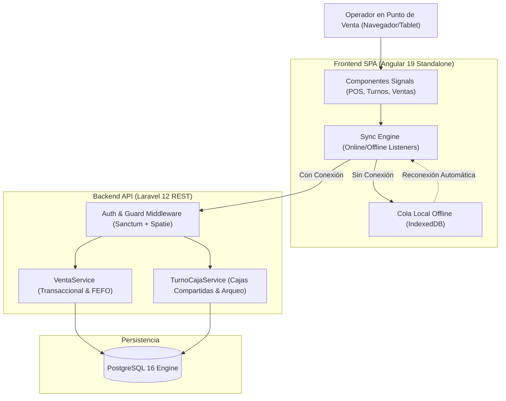

# 🏛️ GuadaluPOS - Arquitectura y Detalles de Implementación

Este documento complementa el archivo [README.md](./README.md) y detalla las decisiones técnicas, modelos de datos, flujos contables y mecanismos de resiliencia implementados en **GuadaluPOS**.

---

## 1. Arquitectura General del Sistema

El sistema adopta una arquitectura desacoplada y orientada a servicios, optimizada para baja latencia en mostrador y alta tolerancia a fallos de conectividad:



---

## 2. Modelado de Base de Datos y Entidades Clave

### A. Gestión de Lotes y Despacho por Paquetes / Unidades
Cada producto puede venderse por unidad suelta o por paquete completo. Un paquete contiene un factor multiplicador `unidades_por_paquete` (por ejemplo, 12 cervezas o 24 paquetes de galletas).

- **Tabla `lotes`**:
  - Almacena `cantidad_paquetes`, `cantidad_unidades` y el `precio_compra_unitario` (costo por unidad base).
  - Al registrar compras, el operador ingresa los **paquetes comprados** y el **precio por paquete**. El sistema deduce el costo unitario:
    $$\text{precio\_compra\_unitario} = \frac{\text{precio\_paquete}}{\text{unidades\_por\_paquete}}$$
  - Soporta fecha de vencimiento (`fecha_vencimiento`).
  - **Despacho FEFO**: `VentaService` consulta los lotes activos ordenados por `fecha_vencimiento ASC NULLS LAST`.
  - **Venta Mayorista**: Si un usuario privilegiado (`master`, `administrador`, `supervisor`) selecciona un lote específico, el algoritmo descuenta prioritariamente de ese lote.

### B. Caja Compartida (`turno_caja_usuario`)
Para escenarios reales donde dos hermanos u operadores atienden un mismo puesto y manejan la misma gaveta de dinero físico:
- Se implementó la tabla pivote `turno_caja_usuario` (`turno_id`, `usuario_id`, `created_at`).
- El primer operador abre el turno asignando el `monto_inicial` en efectivo.
- El segundo operador se une al turno activo del almacén mediante `POST /api/turnos/{id}/unirse`.
- Ambas cuentas de usuario pueden vender simultáneamente sin duplicar el fondo inicial.
- Cada venta registra `usuario_id`, permitiendo desglosar el total vendido por cada hermano al momento del cierre (`desglose_vendedores`).

---

## 3. Motor de Cuadre Contable (Físico vs Digital)

Uno de los principales problemas en puntos de venta tradicionales es el descuadre de caja originado por los pagos digitales (QR y tarjetas).

En **GuadaluPOS**, el modelo `TurnoCaja` expone dinámicamente el accessor `resumen_contable`:

```text
============================================================
              ESTRUCTURA DE CUADRE CONTABLE
============================================================
1. GAVETA DE EFECTIVO FÍSICO (Dinero en billetes y monedas):
   [+] Fondo Inicial de Caja (Apertura)
   [+] Ventas Cobradas en Efectivo
   ---------------------------------------------------------
   [=] EFECTIVO FÍSICO ESPERADO EN GAVETA
       (Base contra la cual se compara el conteo real al cierre)

2. INGRESOS DIGITALES BANCARIOS (Directo a Cuenta / Banco):
   [+] Ventas Cobradas por QR / Transferencia
   [+] Ventas Cobradas por Tarjeta (POS Electrónico)
   ---------------------------------------------------------
   [=] TOTAL DIGITAL EN BANCO (No se busca en la gaveta)

3. TOTAL RECAUDADO GLOBAL:
   [=] Ventas Efectivo + Ventas QR + Ventas Tarjetas
============================================================
```

### Corrección de Método de Pago en Vivo
Si un cajero se equivoca al cobrar y presiona "Efectivo" en lugar de "QR":
- Endpoint: `PATCH /api/ventas/{id}/metodo-pago`
- Valida que el método pertenezca a `['efectivo', 'transferencia', 'tarjeta']`.
- Actualiza la transacción y el cálculo del arqueo de caja se actualiza en tiempo real sin necesidad de anular tickets ni alterar inventarios.

---

## 4. Motor de Rentabilidad y Ganancias (Nivel de Lote)

El sistema calcula la ganancia con exactitud matemática utilizando el costo del lote real del cual se extrajo la mercadería:

$$\text{Costo del Ítem} = \text{Cantidad de Unidades} \times \text{Lote.precio\_compra\_unitario}$$
$$\text{Utilidad Neta de Venta} = \text{Total Cobrado} - \sum \text{Costo del Ítem}$$
$$\text{Margen Comercial \%} = \left(\frac{\text{Utilidad Neta}}{\text{Total Cobrado}}\right) \times 100$$

### Control de Privacidad y Acceso por Roles
- **Backend**: En `VentaController::index`, el campo `precio_compra_unitario` solo se incluye en el árbol JSON si el usuario autenticado tiene roles `master`, `administrador` o `supervisor`.
- **Frontend**: El componente `HistorialVentasComponent` oculta completamente las tarjetas de costo, ganancia neta, columnas de margen y desgloses de tickets a los usuarios con rol `vendedor`.

---

## 5. Estrategia Offline-First (Resiliencia en Mostrador)

Para puestos comerciales donde la conexión Wi-Fi o móvil puede fluctuar durante la atención:

1. **Generación Local de Identificadores**: Cada venta creada en el cliente genera un `client_uuid` (v4 UUID) antes de enviarse a la red.
2. **Cola de Persistencia en IndexedDB**: Si la petición HTTP falla por desconexión (`status === 0` o timeout), la venta se almacena inmediatamente en el almacén de objetos local con estado `pendiente`.
3. **Despacho Inmediato**: El carrito se limpia y la interfaz confirma la venta con un distintivo ámbar (*"Venta guardada localmente - se sincronizará al volver la red"*), evitando filas o demoras al cliente.
4. **Conciliación Idempotente**:
   - Al detectarse el evento `window.online` o al inicializar la pantalla de venta, `SyncService` envía las ventas en cola.
   - El backend busca por `client_uuid`: si la venta ya había sido procesada previamente, responde con el registro existente sin duplicar el descuento de stock ni el cobro.

---

## 6. Seguridad y Buenas Prácticas

- **Bloqueo Pesimista en Inventario**: Las consultas de lotes en `VentaService` utilizan `lockForUpdate()` dentro de transacciones de base de datos (`DB::transaction`) para evitar condiciones de carrera (*race conditions*) en ventas simultáneas del mismo producto.
- **Autorización Estricta de Modificación de Precios**: El backend verifica que cualquier precio enviado diferente al precio de catálogo provenga exclusivamente de un usuario con permisos autorizados (`master`, `administrador`, `supervisor`).
- **Presupuestos de Estilos en Frontend**: Los estilos de componentes se compilan bajo un límite estricto de 12 kB por componente, optimizando la carga en conexiones móviles lentas.
